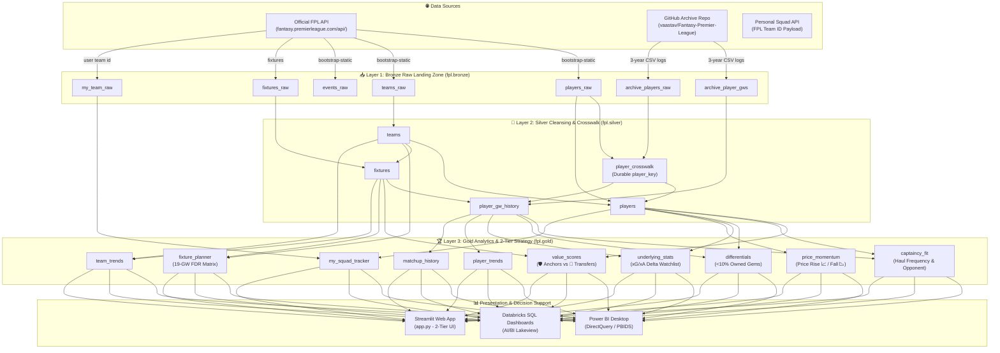

# 📐 System Architecture & Entity-Relationship (ER) Diagrams

This document contains production-ready, exportable diagram code for **Mermaid.js**, **Eraser.io**, and **Lucidchart**.

---

## 1. 🏗️ Medallion Architecture Flow Diagram (Mermaid.js)

*Copy & paste this code into GitHub Markdown, VS Code Mermaid Preview, Eraser.io, or [Mermaid Live Editor](https://mermaid.live).*



---

## 2. 🗄️ Full Entity-Relationship (ER) Diagram (Mermaid.js)

```mermaid
erDiagram

    %% SILVER DIMENSIONS & FACTS
    TEAMS ||--o{ PLAYERS : "belongs to"
    TEAMS ||--o{ FIXTURES : "home/away in"
    TEAMS ||--o{ PLAYER_GW_HISTORY : "opponent in"
    
    PLAYER_CROSSWALK ||--o{ PLAYERS : "identifies"
    PLAYER_CROSSWALK ||--o{ PLAYER_GW_HISTORY : "logs match performance"
    
    %% GOLD ANALYTICAL TABLES
    PLAYER_CROSSWALK ||--o{ VALUE_SCORES : "evaluates Z-score"
    PLAYER_CROSSWALK ||--o{ CAPTAINCY_FIT : "ranks haul frequency"
    PLAYER_CROSSWALK ||--o{ DIFFERENTIALS : "tracks low ownership"
    PLAYER_CROSSWALK ||--o{ UNDERLYING_STATS : "calculates xG delta"
    PLAYER_CROSSWALK ||--o{ PRICE_MOMENTUM : "tracks net transfers"
    PLAYER_CROSSWALK ||--o{ PLAYER_TRENDS : "splits home/away ppg"
    PLAYER_CROSSWALK ||--o{ MATCHUP_HISTORY : "records vs Top-6"

    TEAMS ||--o{ FIXTURE_PLANNER : "aggregates 19-GW FDR"
    TEAMS ||--o{ TEAM_TRENDS : "tracks 6-game form"

    %% TABLE FIELD DEFINITIONS

    TEAMS {
        int team_id PK
        int team_code
        string team_name
        string short_name
        int strength
        int strength_overall_home
        int strength_overall_away
    }

    PLAYER_CROSSWALK {
        int player_key PK
        string season
        string source
        int source_player_id
        string first_name
        string second_name
        string crosswalk_status
    }

    PLAYERS {
        int player_key PK, FK
        int player_id
        string web_name
        string position_name
        int team_id FK
        float price_gbp
        float ownership_percent
        float form
        int minutes
    }

    PLAYER_GW_HISTORY {
        int player_key FK
        string season
        int gameweek
        int total_points
        int minutes
        int goals_scored
        int assists
        float expected_goals
        float expected_assists
        boolean was_home
        int opponent_team_id FK
    }

    FIXTURES {
        int fixture_id PK
        int gameweek
        int home_team_id FK
        int away_team_id FK
        boolean finished
        int home_fdr
        int away_fdr
    }

    VALUE_SCORES {
        int player_key PK, FK
        string web_name
        string position_name
        float price_gbp
        float form_z
        float fixture_ease_z
        float minutes_reliability_z
        float value_score
        string strategy_tier
    }

    FIXTURE_PLANNER {
        int team_id PK, FK
        string team_name
        string short_name
        float avg_5gw_fdr
        float avg_midseason_fdr
        string next_gw_1
        string next_gw_19
        int fdr_gw_1
        int fdr_gw_19
    }

    CAPTAINCY_FIT {
        int captaincy_rank
        int player_key PK, FK
        string web_name
        string position_name
        float haul_frequency_percent
        float captaincy_fit_score
    }

    DIFFERENTIALS {
        int differential_rank
        int player_key PK, FK
        string web_name
        float ownership_percent
        float gi_per_90
        float total_xg
        float total_xa
    }

    UNDERLYING_STATS {
        int player_key PK, FK
        string web_name
        int total_goals
        float total_xg
        float xg_delta
        string due_a_return_flag
    }

    PRICE_MOMENTUM {
        int player_key PK, FK
        string web_name
        int net_transfers_event
        string momentum_direction
    }
```



---

## 3. 🎨 Eraser.io Diagram Code (Icon-Enriched Syntax)

*To import into [Eraser.io](https://app.eraser.io), create a new diagram $\rightarrow$ select **Diagram-as-Code** $\rightarrow$ paste this snippet:*

```text
// Medallion Architecture Data Pipeline Flow with Brand Icons

Data Sources [icon: api] {
  Official FPL API [icon: code]
  GitHub Archive Repo [icon: github]
  User Squad Payload [icon: user]
}

Bronze Layer [icon: databricks, color: orange] {
  fpl_bronze_players_raw [icon: table]
  fpl_bronze_teams_raw [icon: table]
  fpl_bronze_events_raw [icon: table]
  fpl_bronze_fixtures_raw [icon: table]
  fpl_bronze_archive_player_gws [icon: table]
}

Silver Layer [icon: databricks, color: blue] {
  fpl_silver_teams [icon: table]
  fpl_silver_player_crosswalk [icon: key]
  fpl_silver_players [icon: table]
  fpl_silver_player_gw_history [icon: table]
  fpl_silver_fixtures [icon: table]
}

Gold Layer [icon: databricks, color: green] {
  fpl_gold_value_scores [icon: shield]
  fpl_gold_fixture_planner [icon: calendar]
  fpl_gold_captaincy_fit [icon: award]
  fpl_gold_differentials [icon: star]
  fpl_gold_underlying_stats [icon: target]
  fpl_gold_price_momentum [icon: trending-up]
}

Presentation Layer [icon: monitor, color: purple] {
  Power BI Desktop [icon: bar-chart-2]
  Databricks SQL Dashboards [icon: databricks]
  Streamlit Web App [icon: layout]
}

// Connections
Data Sources > Bronze Layer: HTTP API & CSV Ingestion
Bronze Layer > Silver Layer: Cleaning, Type Casting & Priority Crosswalk
Silver Layer > Gold Layer: Position Normalization & 2-Tier Strategy
Gold Layer > Presentation Layer: DirectQuery & Real-Time Visualization
```

---

## 4. ✏️ How to Import into Lucidchart

1. Open **Lucidchart** (`lucidchart.com`).
2. Click **File** $\rightarrow$ **Import Data** $\rightarrow$ select **Mermaid**.
3. Paste either the **Architecture Diagram** code from Section 1 or the **ER Diagram** code from Section 2.
4. Lucidchart will auto-generate your visual diagram with editable shapes and connectors!
