# Fantasy Premier League (FPL) Decision-Support Platform
## Business Requirements Document (BRD) & Insights Delivery Catalog

---

## 1. Executive Summary & Business Objective

The **FPL Decision-Support Platform** is an enterprise-grade sports analytics and business intelligence solution designed to eliminate cognitive bias and gut-feeling decision-making in Fantasy Premier League squad management. 

By combining real-time API telemetry with four years of granular historical match data, the platform delivers **actionable, position-normalized diagnostic intelligence** across transfers, budget allocation, fixture planning, and captaincy selection.

### Core Business Pillars
* **Descriptive & Diagnostic Focus (No Black-Box ML):** Rather than producing unexplainable point forecasts, the platform equips decision-makers with underlying quality metrics ($xG$, $xA$, $xGI$, $xGC$, ICT Index, defensive contributions) and multi-season trend analysis.
* **Position-Normalized Analytics:** Scoring mechanics differ fundamentally by role. Clean sheets and saves govern Goalkeepers/Defenders, while chance creation and finishing govern Midfielders/Forwards. All rankings, percentiles, and composite scores are computed strictly within position peer groups.
* **On-Demand Operational Model:** Eliminates wasteful 24/7 background compute costs. Data refreshes on-demand prior to tactical decision deadlines.

---

## 2. Platform Architecture (Medallion Standard)

```mermaid
flowchart LR
    subgraph Sources["Ingestion Layer"]
        A1["Official FPL REST API<br/>(Live Telemetry & Squad)"]
        A2["Historical Archive<br/>(3-Season Telemetry & xG)"]
    end

    subgraph Bronze["Bronze (Raw Lake)"]
        B1["players_raw"]
        B2["teams_raw"]
        B3["events_raw"]
        B4["fixtures_raw"]
        B5["archive_player_gws"]
        B6["players_gw_snapshot_raw"]
        B7["my_team_raw"]
    end

    subgraph Silver["Silver (Conformed Enterprise Layer)"]
        S1["silver.teams<br/>(Standings & Strength)"]
        S2["silver.player_crosswalk<br/>(Durable Opta ID Bridge)"]
        S3["silver.players<br/>(57 Conformed Metrics)"]
        S4["silver.fixtures<br/>(380 Match Schedule & FDR)"]
        S5["silver.gameweeks<br/>(Calendar & Benchmarks)"]
        S6["silver.my_team_history<br/>(Rank & Budget Tracker)"]
        S7["silver.player_gw_history<br/>(Unified 4-Season Match Logs)"]
    end

    subgraph Gold["Gold (Serving / Decision Support)"]
        G1["Player Valuation Engine"]
        G2["Captaincy Optimization Matrix"]
        G3["Differential Opportunity Finder"]
        G4["Fixture Run Heatmap"]
        G5["Opponent Matchup Analyzer"]
        G6["Personal Squad Tracker"]
    end

    Sources --> Bronze
    Bronze --> Silver
    Silver --> Gold
```



---

## 3. Formal Functional Requirements Specification

```
┌──────────────────────────────────────────────────────────────────────────────────────────────────┐
│                                   FUNCTIONAL REQUIREMENTS MATRIX                                │
├────┬──────────────────────────────────┬───────────────────────┬─────────────────────────────────────┤
│ ID │ Requirement Name                 │ Business Priority     │ Target Decision Area                │
├────┼──────────────────────────────────┼───────────────────────┼─────────────────────────────────────┤
│ 01 │ Player Value & Form Analysis     │ Critical (Core)       │ Transfer Shortlisting               │
│ 02 │ Historical Trend Drill-Down      │ High                  │ Deep-Dive Player Evaluation         │
│ 03 │ Opponent & Matchup Analysis      │ High                  │ Tactical Matchup Selection          │
│ 04 │ Team Attack/Defense Trends       │ High                  │ Club-Level Asset Stacking           │
│ 05 │ Multi-Gameweek Fixture Planner   │ Critical (Core)       │ Medium-Term Transfer Roadmaps       │
│ 06 │ Differential Opportunity Finder  │ Medium-High           │ Mini-League Rank Progression        │
│ 07 │ Price Momentum & Market Trends   │ Medium                │ Budget Preservation & Value Timing  │
│ 08 │ Underlying Metrics Engine (xG/xA)│ Critical (Core)       │ Variance & Regression Detection     │
│ 09 │ Personal Squad & Rank Tracker    │ High                  │ Portfolio & Chip Management         │
│ 10 │ On-Demand Orchestration Control  │ Operational SLA       │ Cost Control & Timely Data Access   │
│ 11 │ Position-Normalized Ranking      │ Architectural Rule    │ Fair Comparison Across Asset Classes│
│ 12 │ Captaincy Fit Optimization       │ Critical (Core)       │ Maximum Point Yield Selection       │
└────┴──────────────────────────────────┴───────────────────────┴─────────────────────────────────────┘
```

---

### FR-01: Player Value & Form Analysis
* **Business Need:** Decision-makers need to rapidly identify high-efficiency assets within strict budgetary constraints without manually reviewing hundreds of player profiles.
* **Functional Delivery:** Blends recent form, upcoming fixture ease (FDR), and minutes security into a single composite Value Index computed separately for each position.
* **Business Value:** Provides instant shortlists (e.g., *"Top 5 Midfielders under £8.0m with high expected involvement over the next 4 gameweeks"*).

### FR-02: Historical Multi-Season Drill-Down
* **Business Need:** Single-game performance often masks underlying inconsistency. Decision-makers require multi-season historical verification.
* **Functional Delivery:** Delivers time-series trend analysis spanning up to 4 seasons (~114+ matches), segmented by Home vs. Away venues, opponent difficulty tiers, and minutes played.
* **Business Value:** Uncovers venue biases (e.g., assets that overperform at home but struggle in away fixtures).

### FR-03: Opponent & Matchup Analysis
* **Business Need:** Certain players or clubs have structural advantages against specific tactical systems (e.g., high-line defenses, promoted clubs, top-6 opposition).
* **Functional Delivery:** Aggregates historical performance metrics against specific upcoming opponents and opponent tiers.
* **Business Value:** Confirms whether an apparently difficult fixture has historically been profitable for an asset.

### FR-04: Team-Level Attacking & Defensive Trends
* **Business Need:** Individual player returns depend heavily on team tactical momentum.
* **Functional Delivery:** Tracks rolling team-level metrics ($xG$ generated, $xGC$ conceded, clean sheet rates, shots conceded in the box) over 4-game, 6-game, and season horizons.
* **Business Value:** Flags teams in strong defensive runs to target for defender double-ups or weak defensive units to target with opposing attackers.

### FR-05: Multi-Gameweek Fixture Difficulty Planner
* **Business Need:** FPL transfers involve opportunity costs; buying an asset for one week only to sell them the next destroys squad value.
* **Functional Delivery:** A rolling $N$-Gameweek fixture difficulty matrix (1 to 5 FDR) with visual heatmaps and cumulative difficulty scores per team.
* **Business Value:** Enables proactive transfer roadmaps 3–6 weeks before favorable fixture swings occur.

### FR-06: Differential Opportunity Finder
* **Business Need:** Climbing overall rank and overtaking mini-league competitors requires owning high-performing players with low general ownership.
* **Functional Delivery:** Filters for players with $< 10\%$ total ownership who rank in the top quartile for underlying chance creation ($xGI$ per 90, threat, shots in the box).
* **Business Value:** Surfaces hidden gems before their ownership surges and prices inflate.

### FR-07: Price Momentum & Market Tracker
* **Business Need:** Team budget growth allows managers to afford premium players later in the season.
* **Functional Delivery:** Tracks net transfer activity (transfers in/out per event) and price delta velocity to flag players at risk of price rises or drops.
* **Business Value:** Enables timely transfer execution before overnight price changes occur.

### FR-08: Underlying Quality Metrics Layer ($xG, xA, xGI, xGC, ICT$)
* **Business Need:** Raw goals and assists are subject to high short-term variance (luck). Underlying statistical quality reveals true underlying form.
* **Functional Delivery:** Conforms and exposes expected goals ($xG$), expected assists ($xA$), expected goal involvement ($xGI$), expected goals conceded ($xGC$), and the ICT Index.
* **Business Value:** Prevents premature sales of "unlucky" players generating high $xG$, and warns against buying players scoring low-probability goals.

### FR-09: Personal Squad & Rank Telemetry
* **Business Need:** Manual entry of squad selections, bench players, and budget balances is error-prone and tedious.
* **Functional Delivery:** Ingests live manager team data via FPL Team ID to track overall rank trajectory, weekly gameweek score vs. world average, bank balance (£m), and remaining chip inventory.
* **Business Value:** Delivers a 360-degree portfolio dashboard customized to the manager's exact assets.

### FR-10: On-Demand Manual Refresh Pipeline
* **Business Need:** The platform must provide up-to-the-minute data before deadlines without incurring recurring cloud costs.
* **Functional Delivery:** Single-button manual trigger in Databricks Workflows that orchestrates Bronze $\rightarrow$ Silver $\rightarrow$ Gold transformations in $< 60$ seconds.
* **Business Value:** Zero idle infrastructure waste with 100% data freshness guarantee on demand.

### FR-11: Position-Normalized Scoring Architecture
* **Business Need:** Cross-position ranking is inherently flawed due to distinct point-scoring mechanics.
* **Functional Delivery:** Segregates all scoring engines into four distinct peer groups: Goalkeepers (GKP), Defenders (DEF), Midfielders (MID), and Forwards (FWD).
* **Business Value:** Guarantees fair, position-appropriate evaluation (e.g., rewarding clean sheets/DefCon for defenders and shots/xG for forwards).

### FR-12: Weekly Captaincy Fit Optimization Panel
* **Business Need:** The captain yields double points ($2\times$), making captaincy selection the single highest-variance weekly decision.
* **Functional Delivery:** A specialized scoring matrix that ranks squad options on ceiling/explosiveness, opponent defensive vulnerability, home/away split, and historical opponent dominance.
* **Business Value:** Flags high-ceiling captain choices rather than settling for generic template picks.

---

## 4. Business Dashboards & Insights Delivery Portfolio

The platform delivers its intelligence through **six dedicated executive dashboard views**:

```
┌────────────────────────────────────────────────────────────────────────────────────────┐
│                        DELIVERED BUSINESS DASHBOARD PORTFOLIO                          │
├────────────────────────────────────────────────────────────────────────────────────────┤
│ 1. Squad Operations & Rank Portfolio (Personal Performance, Budget, Bank, Bench)       │
│ 2. Position-Normalized Transfer Shortlists (Best GKP, DEF, MID, FWD by Value Index)   │
│ 3. Fixture Swing & FDR Planner (3 to 6 Gameweek Visual Heatmap)                        │
│ 4. Weekly Captaincy Fit Matrix (Ceiling, Matchup Vulnerability, Home/Away Split)       │
│ 5. Differential Opportunity Radar (Low Ownership, High Underlying xGI)                 │
│ 6. Deep-Dive Diagnostic Workspace (Player Multi-Season Trends vs. Opponent Tiers)      │
└────────────────────────────────────────────────────────────────────────────────────────┘
```

### Dashboard View 1: Personal Squad Operations & Portfolio Tracker
* **Audience:** Manager / Decision-Maker
* **Key Visuals & KPIs:**
  - **KPI Cards:** Current Global Rank, Weekly Gameweek Score, World Average Delta ($\pm$), Free Bank Balance (£m), Squad Market Value (£m).
  - **Trend Chart:** Overall Rank Trajectory across the season with transfer hit annotations.
  - **Active Squad Table:** Starter/Bench point breakdown, fixture difficulty for the week, and availability status flags.
  - **Chip Management Badge:** Status of Wildcard, Free Hit, Triple Captain, Bench Boost.

### Dashboard View 2: Position-Normalized Transfer Shortlist
* **Audience:** Strategic Squad Planners
* **Key Visuals & KPIs:**
  - **Position Segment Tabs:** GKP | DEF | MID | FWD
  - **Interactive Sliders:** Maximum Price Cap (£m), Minimum Minutes Played Threshold, Fixture Horizon ($N$ gameweeks).
  - **Ranked Leaderboard Table:** Player Name, Club, Current Price, Form Index, Fixture Ease Score, Value Rating ($xGI / \text{Price}$).
  - **Action Callout:** Top 3 recommended transfer targets matching the active budget.

### Dashboard View 3: Multi-Week Fixture Swing Matrix
* **Audience:** Medium-Term Strategic Planners
* **Key Visuals & KPIs:**
  - **Color-Coded Heatmap:** 20 Premier League clubs across the next 6 Gameweeks (Green = Easy/FDR 2, Grey = Medium/FDR 3, Red = Difficult/FDR 4–5).
  - **Fixture Ticker Score:** Sorted list of clubs with the easiest upcoming schedules.
  - **Target Attackers / Target Defenders:** Highlights specific clubs entering favorable attacking or defensive fixture runs.

### Dashboard View 4: Captaincy Fit Matrix
* **Audience:** Weekly Tactical Decision-Makers
* **Key Visuals & KPIs:**
  - **Captaincy Fit Index (CFI):** Ranked list of owned starters.
  - **Radar / Score Decomposition:** 
    - Explosiveness Rating (Haul frequency $> 10$ pts)
    - Opponent Defensive Leakiness ($xGC$ conceded by opponent)
    - Home Advantage Multiplier
    - Historical Record vs. Exact Opponent
  - **Safe Pick vs. Differential Captain Recommendation.**

### Dashboard View 5: Differential Opportunity Radar
* **Audience:** High-Risk / High-Reward Strategic Planners
* **Key Visuals & KPIs:**
  - **Scatter Plot:** Ownership % ($X$-axis, capped at $< 10\%$) vs. Underlying $xGI$ per 90 ($Y$-axis).
  - **Opportunity Table:** Low-owned gems with guaranteed starter minutes ($> 75\text{ mins/game}$) and impending price rises.

### Dashboard View 6: Diagnostic Player Deep-Dive Workspace
* **Audience:** Analysts & In-Depth Evaluators
* **Key Visuals & KPIs:**
  - **Player Search & Selector:** Interactive dropdown covering all ~700 active Premier League assets.
  - **Historical Performance Chart:** 4-season gameweek time-series points, goals, assists, and $xG$ vs. actual goals.
  - **Venue & Opponent Breakdown:** Home vs. Away average returns, performance against Top 6 vs. Bottom 6 clubs.
  - **Underlying Consistency vs. Variance:** Comparison of expected returns ($xG + xA$) against actual fantasy returns.

---

## 5. Metric & KPI Glossary

| Metric Name | Business Definition | Practical Decision Impact |
|---|---|---|
| **$xG$ (Expected Goals)** | Statistical measure of chance quality based on shot location, angle, and assist type. | Identifies strikers who are creating high-quality chances regardless of whether the ball went in. |
| **$xA$ (Expected Assists)** | Likelihood that a pass will lead directly to a goal. | Identifies playmakers consistently providing goal-scoring opportunities to teammates. |
| **$xGI$ (Expected Goal Involvement)** | $xG + xA$. Total direct attacking contribution expectation. | Primary metric for evaluating midfielders and forwards. |
| **$xGC$ (Expected Goals Conceded)** | Total quality of chances allowed by a team defense. | Key metric for picking goalkeepers and defenders likely to keep clean sheets. |
| **FDR (Fixture Difficulty Rating)** | Official 1–5 scale reflecting the difficulty of an upcoming match. | Governs multi-week transfer timing and fixture swing planning. |
| **ICT Index** | Composite index evaluating Influence (game impact), Creativity (chance creation), and Threat (scoring attempt). | Provides a holistic underlying performance benchmark. |
| **Value Index** | Custom composite metric: $\frac{\text{Recent Form} \times \text{Fixture Ease}}{\text{Price (£m)}}$. | Ranks players by return on financial investment per position group. |
| **Captaincy Fit Index (CFI)** | Composite score blending ceiling variance, opponent $xGC$, venue, and minutes reliability. | Drives the weekly double-point captaincy choice. |

---

## 6. Data Governance & Operational Quality Gates

* **Data Freshness SLA:** Telemetry is updated on-demand $< 60\text{ seconds}$ post-trigger.
* **Identity Reconciliation:** 100% of historical match logs (~39,800 rows) are unified under persistent Opta player IDs (`player_key`), eliminating duplicate seasonal records.
* **Active League Focus:** Relegated and departed assets are filtered out of fact tables, preserving memory, storage, and query speed.
* **Auditability:** Every Delta table retains `_ingested_at` audit timestamps and full schema enforcement.
